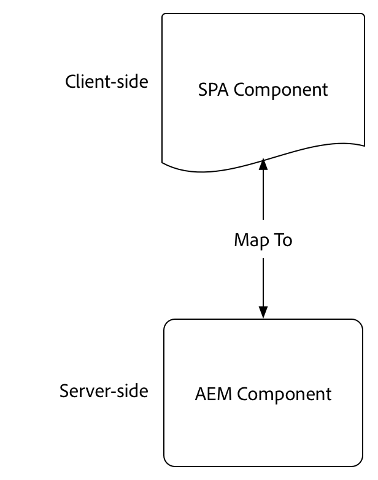
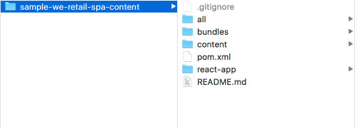
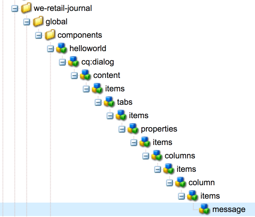
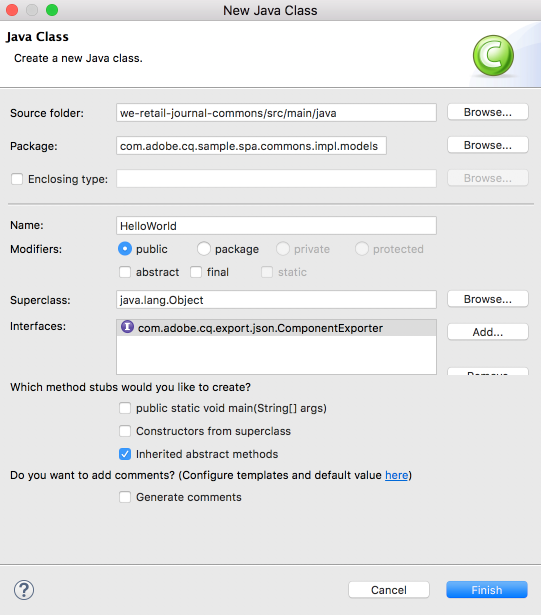
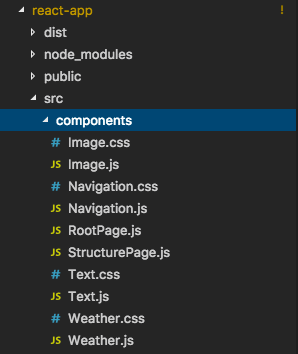
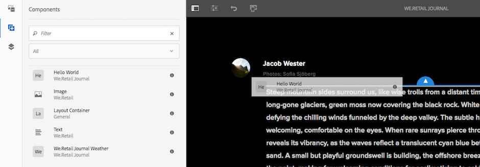
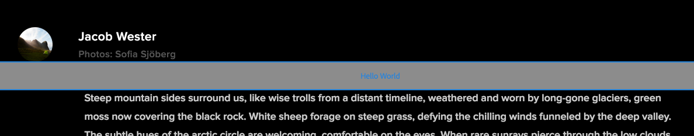
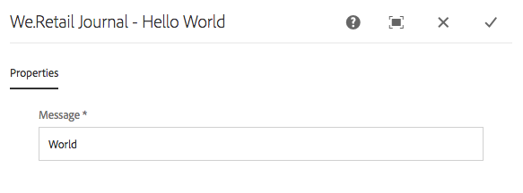
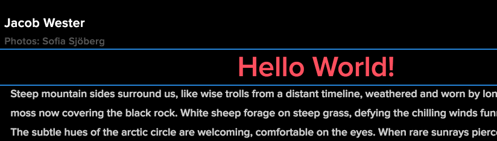
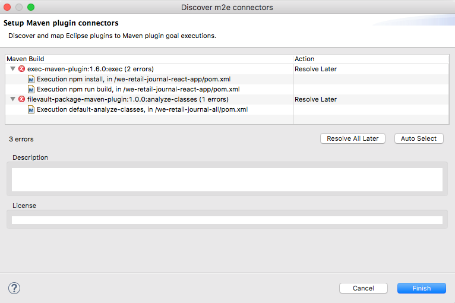

## Getting Started with the AEM SPA Editor - HelloWorld Tutorial

AEM's SPA Editor provides support for incontext editing of a Single Page Application or SPA. This tutorial is an introduction to SPA development to be used with AEM's SPA Editor JS SDK. The tutorial will extend the We.Retail Journal app by adding a custom **Hello World** component.

This tutorial is intended to highlight the steps needed to map a SPA component to an AEM component to enable in-context editing. Users starting this tutorial should be familiar with basic concepts of development with Adobe Experience Manager, AEM as well as developing with React. The tutorial covers both back-end and front-end development tasks.

## Prerequisite Reading

The following resources are recommended to be reviewed before starting this tutorial:

* [SPA Walkthrough](https://helpx.adobe.com/experience-manager/6-4/sites/developing/using/spa-walkthrough.html) - Overview of single page applications.
* [SPA Editor Feature Video](https://helpx.adobe.com/experience-manager/kt/sites/using/spa-editor-framework-feature-video-use.html) - A video overview of the SPA Editor and We.Retail Journal app.
* [WKND Tutorial](https://helpx.adobe.com/experience-manager/kt/sites/using/getting-started-wknd-tutorial-develop.html) - A good introduction to traditional AEM Sites development.
* [React.js Tutorial](https://reactjs.org/tutorial/tutorial.html) - An introduction to developing with the React framework.

## Local Development Environment

This tutorial is designed for:

[Adobe Experience Manager 6.4](https://helpx.adobe.com/experience-manager/6-4/sites/deploying/using/technical-requirements.html) + SPA Editor Feature Pack 0.2.0

> Note the SPA Editor Feature Pack is currently only available through the [SPA Editor Beta Program](http://bit.ly/beta-aem-spa). 

In this tutorial the following technologies and tools should be installed:

1. [Java 1.8](http://www.oracle.com/technetwork/java/javase/downloads/index.html)
2. [Apache Maven - 3.3.1+](https://maven.apache.org/)
3. [Node.js - 8.11.1+](https://nodejs.org/en/) and npm 5.6.0+ (npm is installed with node.js)

Double check the installation of the above tools by opening up a new terminal and running the following:

```
$ java -version
java version "1.8.0_111"

$ mvn -version
Apache Maven 3.3.9

$ node --version
v8.11.1

$ npm --version
6.1.0

```

## Overview

The basic concept is to map a SPA Component to an AEM Component.  AEM components, running server-side, export content in the form of JSON. The JSON content is consumed by the SPA, running client-side in the browser.  A 1:1 mapping between a SPA components and an AEM component is created.



## Project Setup

The goal of this tutorial is to extend the We.Retail Journal App with a new component. Start by downloading the source code for the We.Retail Journal app and deploying to a local AEM.

1. Download the following zip file containing the We.Retail Journal source code: [SRC-sample-we-retail-spa-content.zip](./packages/SRC-sample-we-retail-spa-content.zip)

2. Unzip the contents to the local file system. The following structure should be visible:


The project contains the following maven modules:

* `all`: Embeds and installs the entire project in a single package. 
* `bundles` : Contains two OSGi bundles: **commons** and **core** that contain Sling Models and other Java code.
* `content`: Content Structure including /apps components and client libraries. The client library JS and CSS for the SPA will be generated by the `react-app` module.
* `react-app`: We.Retail Journal React application. This is both a Maven module and a webpack project.

3. Open a new terminal window and run the following command to build and deploy the entire app to a local AEM instance running on http://localhost:4502.

```
$ cd <src>/sample-we-retail-spa-content
$ mvn -PautoInstallSinglePackage clean install
```
> Note that the Maven profile to build and package the entire project is `autoInstallSinglePackage`

4. Navigate to: [http://localhost:4502/editor.html/content/we-retail-journal/react.html](http://localhost:4502/editor.html/content/we-retail-journal/react.html). The We.Retail Journal App should be displayed within the AEM Sites editor. 

5. In Edit mode, select a component to edit and make an update to the content.

## Create AEM Component

An AEM component will be created first. The AEM component is responsibe for rendering the JSON properties that are read by the React component. The AEM component is also responsible for providing a dialog for any editable properties of the component.

Using Eclipse, or other IDE, import the We.Retail Journal Maven project.

1. In the **we-retail-journal-content** (`<src>/sample-we-retail-spa-content/content`) module create a new node beneath `/apps/we-retail-journal/global/components` named **helloworld** of type **cq:Component**.
2. Add the following properties to the **helloworld** component, represented in XML below:

```
<?xml version="1.0" encoding="UTF-8"?>
<jcr:root xmlns:cq="http://www.day.com/jcr/cq/1.0" xmlns:jcr="http://www.jcp.org/jcr/1.0"
    jcr:description="Hello World Component for We.Retail Journal"
    jcr:primaryType="cq:Component"
    jcr:title="Hello World"
    componentGroup="We.Retail Journal"/>

```

3. Next a dialog will be created to allow for a custom message to be configured for the **Hello World** component. Beneath `/apps/we-retail-journal/global/components/helloworld` add a node name **cq:dialog** of **nt:unstructured**.

4. The **cq:dialog** will display a single textfield that persists text to a property named **message**. Beneath the newly created **cq:dialog** add the following nodes and properties, represented in XML below:

```
<?xml version="1.0" encoding="UTF-8"?>
<jcr:root xmlns:sling="http://sling.apache.org/jcr/sling/1.0" xmlns:cq="http://www.day.com/jcr/cq/1.0" xmlns:jcr="http://www.jcp.org/jcr/1.0" xmlns:nt="http://www.jcp.org/jcr/nt/1.0"
    jcr:primaryType="nt:unstructured"
    jcr:title="We.Retail Journal - Hello World"
    sling:resourceType="cq/gui/components/authoring/dialog">
    <content
        jcr:primaryType="nt:unstructured"
        sling:resourceType="granite/ui/components/coral/foundation/container">
        <items jcr:primaryType="nt:unstructured">
            <tabs
                jcr:primaryType="nt:unstructured"
                sling:resourceType="granite/ui/components/coral/foundation/tabs"
                maximized="{Boolean}true">
                <items jcr:primaryType="nt:unstructured">
                    <properties
                        jcr:primaryType="nt:unstructured"
                        jcr:title="Properties"
                        sling:resourceType="granite/ui/components/coral/foundation/container"
                        margin="{Boolean}true">
                        <items jcr:primaryType="nt:unstructured">
                            <columns
                                jcr:primaryType="nt:unstructured"
                                sling:resourceType="granite/ui/components/coral/foundation/fixedcolumns"
                                margin="{Boolean}true">
                                <items jcr:primaryType="nt:unstructured">
                                    <column
                                        jcr:primaryType="nt:unstructured"
                                        sling:resourceType="granite/ui/components/coral/foundation/container">
                                        <items jcr:primaryType="nt:unstructured">
                                            <message
                                                jcr:primaryType="nt:unstructured"
                                                sling:resourceType="granite/ui/components/coral/foundation/form/textfield"
                                                fieldLabel="Message"
                                                name="./message"
                                                required="{Boolean}true"/>
                                        </items>
                                    </column>
                                </items>
                            </columns>
                        </items>
                    </properties>
                </items>
            </tabs>
        </items>
    </content>
</jcr:root>
```

5. Deploy the code base to AEM. In [CRXDE-Lite](http://localhost:4502/crx/de/index.jsp#/apps/we-retail-journal/global/components/helloworld) validate the component has been deployed.



## Create Sling Model

Next a Sling Model is created to back the **Hello World** component. In a traditional WCM use case the Sling Model implements any business logic and a server-side rendering script (HTL) will make a call to the Sling Model. This keeps the rendering script relatively simple. 

Sling Models are also used in the SPA use case to implement server-side business logic. The difference is that in the SPA use case, the Sling Model exposes it's methods as seriaized JSON.

> *Note, in simple use cases the default AEM Content Services exporter will expose a component's properties as JSON and a custom Sling Model is not necessary. If any server-side logic needs to be applied prior to output then a Sling Model should be used.*

1. In the editor of your choice, open the **we-retail-journal-commons** project (`<src>/sample-we-retail-spa-content/bundles/commons`).
2. In the package `com.adobe.cq.sample.spa.commons.impl.models` create a new class named `HelloWorld`. Add an implementing interface for `com.adobe.cq.export.json.ComponentExporter`.



The ComponentExporter interface is the interface that must be implemented in order to be compatible with AEM Content Services.

3. Within the class add the following static variable to identify the HelloWorld component's resource type.

```
...

public class HelloWorld implements ComponentExporter {
    
    static final String RESOURCE_TYPE = "we-retail-journal/global/components/helloworld";

    ...
}
```

4. Add the OSGi annotations for `Model` and `Exporter`. The `Model` annotation will register the class as a Sling Model. The `Exporter` annotation will expose the methods as serialized JSON using the Jackson Exporter framework.

```
...
@Model(
        adaptables = SlingHttpServletRequest.class, 
        adapters = {ComponentExporter.class}, 
        resourceType = HelloWorld.RESOURCE_TYPE,
        defaultInjectionStrategy = DefaultInjectionStrategy.OPTIONAL
)
@Exporter(
        name = ExporterConstants.SLING_MODEL_EXPORTER_NAME, 
        extensions = ExporterConstants.SLING_MODEL_EXTENSION
)
public class HelloWorld implements ComponentExporter {

    ...
```

5. Implement the method `getDisplayMessage()` to return the jcr property `message`. Use the Sling Model annotation of `@ValueMapValue` to make it easy to retrieve the property `message` stored beneath the component. As part of the "business logic" of the `getDisplayMessage()` will prepend a string "Hello" before the `message`.

```
   ...

   static final String RESOURCE_TYPE = "we-retail-journal/global/components/helloworld";

   private static final String PREPEND_MSG = "Hello";
    
    @ValueMapValue
    private String message;
    
    public String getDisplayMessage() {
        if(message != null && message.length() > 0) {
            return PREPEND_MSG + " "  + message;
        }
        return null;
    }

    ...
    
```

6. Finally implement the method `getExportedType()` to return the resource type of the helloworld component.

```
    @Override
    public String getExportedType() {
        return RESOURCE_TYPE;
    }

```

7. The full code for [HelloWorld.java can be found here.](./src/bundles/commons/HelloWorld.java)
8. Deploy the code to AEM using Maven:

```
$ cd <src>/sample-we-retail-spa-content/bundles/commons
$ mvn -PautoInstallPackage clean install
```

Verify the deployment and registration of the Sling Model by navigating to [Status > Sling Models](http://localhost:4502/system/console/status-slingmodels) in the OSGi Console.

You should see that the HelloWorld Model is bound to the helloworld resource type and that it is registered as a Sling Model Exporter Servlet:

```
com.adobe.cq.sample.spa.commons.impl.models.HelloWorld - we-retail-journal/global/components/helloworld
com.adobe.cq.sample.spa.commons.impl.models.HelloWorld exports 'we-retail-journal/global/components/helloworld' with selector 'model' and extension '[Ljava.lang.String;@6480f3e5' with exporter 'jackson'
```

## Create the React Component

Next the React component will be created. Open the **react-app** module (`<src>/sample-we-retail-spa-content/react-app`) using the editor of your choice. 

1. Inside the `react-app` folder navigate to its `src` folder. Expand the `components` folder to view the existing React component files. 



2. Add a new file beneath the `components` folder named `HelloWorld.js`.

3. Open `HelloWorld.js`. Add an import statements to import the React component library. Add a second import statement to import the `MapTo` helper provided by Adobe. The `MapTo` helper provides mapping of the React component to the AEM component's JSON.

```
import React, {Component} from 'react';
import {MapTo} from '@adobe/cq-react-editable-components';
```

4. Beneath the imports create a new class named `HelloWorld` that extends the React `Component` interface. Add the required `render()` method to the HelloWorld class.

```
class HelloWorld extends Component {

    render() {

    }
}
```

5. The `MapTo` helper automatically includes an object named `cqModel` as part of the React component's `props`. The `cqModel` includes all properties exposed by the Sling Model. Remember that the Sling Model created earlier contains a method `getDisplayMessage()`. `getDisplayMessage()` is translated to `displayMessage` when outputted.

Implement the `render()` method to output an `h1` tag that contains the value of `displayMessage`. [JSX](https://reactjs.org/docs/introducing-jsx.html), a syntax extension to JavaScript, is used to return the final markup of the component.

```
...

  render() {
        let displayMessage;

        if(this.props.cqModel) {
            displayMessage = this.props.cqModel.displayMessage;

            return (
                <div className="cmp-helloworld">
                    <h1 className="cmp-helloworld--message">{displayMessage}</h1>
                </div>
            );
        }
        
        return null;
    }
...

```

6. Implement an edit configuration method. This method is passed via the `MapTo` helper and provides the AEM editor with information to display a placeholder in the case the component is empty. This occurs when the component is added to the SPA, but has not yet been authored. Add the following outside of the `HelloWorld` class.

```
...

class HelloWorld extends Component {
    ...
}

const HelloWorldEditConfig = {

    emptyLabel: 'Hello World',

    isEmpty: function() {
        return !this.props || !this.props.cqModel || !this.props.cqModel.displayMessage || this.props.cqModel.displayMessage.trim().length < 1;
    }
};

...
```

7. Finally add the below line, at the end of the file, to call the `MapTo` helper, passing the `HelloWorld` class and the `HelloWorldEditConfig`. This will map the React Component to the AEM component based on the AEM Component's resource type: `we-retail-journal/global/components/helloworld`.

```
MapTo('we-retail-journal/global/components/helloworld')(HelloWorld, HelloWorldEditConfig);

```

8. The completed code for [HelloWorld.js can be found here.](./src/react/HelloWorld.js)
9. Open the file `index.js`. `index.js` is the entry point of the React app. It can found at `<src>/sample-we-retail-spa-content/react-app/src/index.js`. Add a line to require the `HelloWorld.js` with the other components in the compiled JavaScript bundle:

```
...
require('./components/Text');
require('./components/Image');
require('./components/HelloWorld');

...
```

10. In the `components` folder create a new file named `HelloWorld.css` as a sibling of `HelloWorld.js`. Populate the file with the following to create some basic styling for the `HelloWorld` component:

```
/* HelloWorld.css to style HelloWorld component */

.cmp-helloworld--message {
    text-align: center;
    color: #ff505e;
    text-transform: unset;
    letter-spacing: unset;
}

```

10. Re-open `HelloWorld.js` and update below the import statements to require `HelloWorld.css`:

```
import React, {Component} from 'react';
import {MapTo} from '@adobe/cq-react-editable-components';

require('./HelloWorld.css');

...
```

## Putting it all together

1. Deploy the code to AEM using Maven:

```
$ cd <src>/sample-we-retail-spa-content
$ mvn -PautoInstallSinglePackage clean install

```

In [CRXDE-Lite](http://localhost:4502/crx/de/index.jsp#/apps/we-retail-journal/react/clientlibs/we-retail-journal-react/js/app.js) open `/apps/we-retail-journal/react/clientlibs/we-retail-journal-react/js/app.js`. Perform a quick search for `HelloWorld` in `app.js` to verify the React component has been included in the compiled app. 

> `app.js` is the bundled React app. The code is no longer readable. The webpack project has bundled all of the dependencies and then run the app through [Babel](https://babeljs.io/) to ensure the javascript will run in older browsers.

2. Navigate to [http://localhost:4502/editor.html/content/we-retail-journal/react.html](http://localhost:4502/editor.html/content/we-retail-journal/react.html). Drag and drop a Hello World component on to the page. 



3. The placeholder should appear. 



Select the component and add a message in the dialog, i.e "World" or "Your Name". Save the changes. 



4. You should now see the content changes reflected in the SPA:



Note that the string "Hello " is always prependend to the message. This is a result of the logic in the HelloWorld.java Sling Model.

## Finished Package

An AEM package with the completed tutorial code can be found here: [END-we-retail-journal-all-0.2.5-SNAPSHOT.zip](./packages/END-we-retail-journal-all-0.2.5-SNAPSHOT.zip)

## Troubleshooting

**Error**

An error when importing the We.Retail Journal project into Eclipse for unrecognized goal executions: "Execution npm install, Execution npm run build, Execution default-analyze-classes". 



**Resolution**

Click Finish to resolve these later. This should not prevent the completion of the tutorial.

**Error**

The React module, **react-app**, errors out during Maven execution:

**Resolution**

Try deleting the `node_modules` folder beneath the `react-app`. Re-run the maven command `mvn clean install -PautoInstallSinglePackage` from the root of the project.


